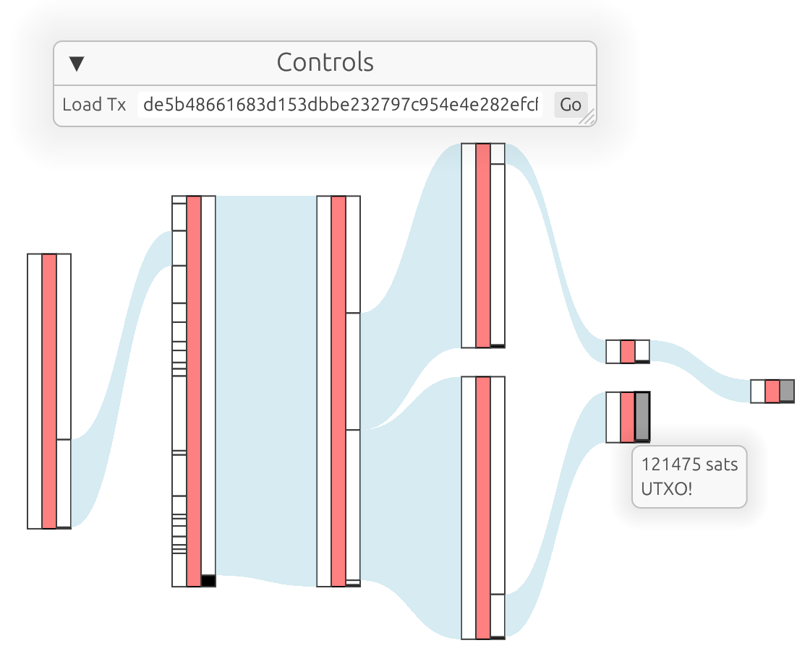

# coin tracker

Follow the coins [Sankey](https://en.wikipedia.org/wiki/Sankey_diagram) style.

### Testing locally

Make sure you are using the latest version of stable rust by running `rustup update`.

`cargo run --release`

On Linux you need to first run:

`sudo apt-get install libxcb-render0-dev libxcb-shape0-dev libxcb-xfixes0-dev libxkbcommon-dev libssl-dev`
